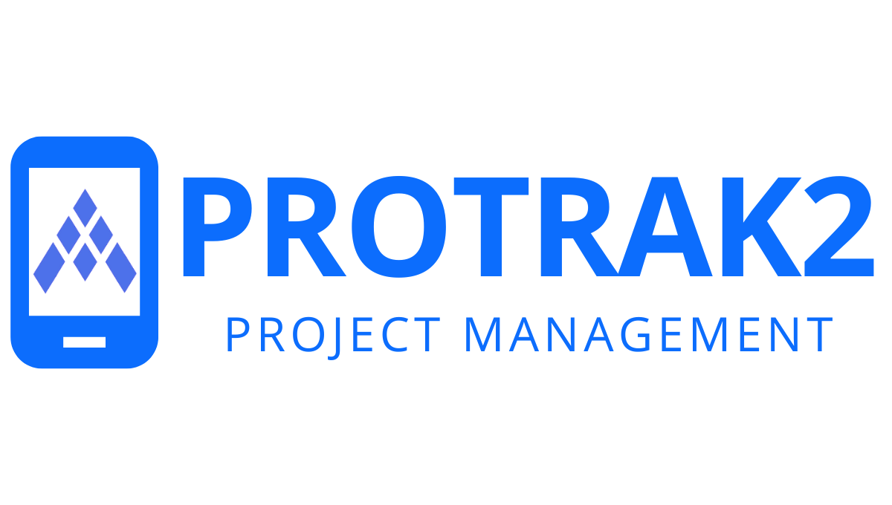

# Protrak2 

A full-stack app that Admin Users can create and update projects, assign projects to the technicians, and view when projects are completed. Techs can see projects assigned to them, update notes, and mark a project as complete .

## Why I Built This

I built this app to help companies manage their projects efficiently by providing a platform for Project Coordinators (Admin Users) to create and update projects and assign them to the appropriate technicians. This app makes it easy for Admin Users to keep track of all ongoing projects and their progress, allowing them to view when projects are completed.

For Technicians, the app provides an easy-to-use interface that allows them to see the projects assigned to them, update notes, and mark projects as complete. The app streamlines communication between Admin Users and Technicians, ensuring that everyone involved in the project is on the same page.


## Technologies Used

- React
- React-Bootstrap
- Express
- PostgreSQl
- Node.js
- ES6
- HTML5
- CSS3
- Heroku

## Live Demo

Try the application live at [https://protrak2.herokuapp.com/](https://protrak2.herokuapp.com/).

## Features

- Users can login
- Admin User can create projects
- Admin User can update projects
- Admin User can assign projects to technician accounts
- Tech User can view projects assigned to them
- Tech User can update notes and complete projects
- Admin User can create new users and assign role
- Admin Users can view unassigned, assigned and completed projects

## Preview


https://user-images.githubusercontent.com/98434681/224394231-ff421a67-73e8-4e2d-b028-17c86aec1d59.mov


https://user-images.githubusercontent.com/98434681/224394242-816b335c-c9d7-4c7e-ad1b-57a82856e2ba.mov


https://user-images.githubusercontent.com/98434681/224394951-0f389269-19c9-49c5-ad2d-b0e76f720def.mov


## Development

### System Requirements

- [React](https://www.npmjs.com/package/react) 17 or higher
- [react-dom](https://www.npmjs.com/package/react-dom) 17 or higher
- [Node.js](https://nodejs.org/en/download/) 10 or higher

### Getting Started

1. Clone the repository.

    ```shell
    git clone https://github.com/Dprosser4/protrak2.git
    cd protrak2
    ```

2. Install all dependencies with NPM.

    ```shell
    npm install
    ```

3. Create a copy of the `.env.example` file.

    ```shell
    cp .env.example .env
    ```

4. In the `.env` file, replace `changeMe` with a random value (a random string generator is recommended).

    ```shell
    TOKEN_SECRET=changeMe
    ```

5. Start the database server.

    ```shell
    sudo service postgresql start
    ```

6. Create a new database.

    ```shell
    createdb protrak2
    ```

8. Import the `schema.sql` and `data.sql` files to the database.

    ```shell
    npm run db:import
    ```

9. (Optional) Start pgweb. Once started, you can view the database by opening http://0.0.0.0:8081/ in your browser.

    ```shell
    pgweb --db=protrak2
    ```

10. Start the project. Once started, you can view the application by opening http://localhost:3000 in your browser.

    ```shell
    npm run dev

